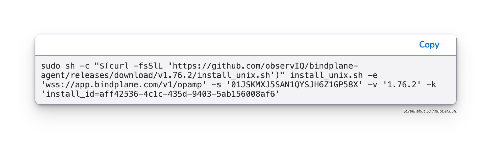

## Docker Compose

The Bindplane Distro for OpenTelemetry (BDOT) Collector can be installed with Docker and Docker Compose.

## Prerequisites

Before installing the Bindplane Distro for OpenTelemetry Collector using Docker Compose, ensure you have the following installed:

- Docker Engine (version 20.10.0 or later)
- Docker Compose (version 2.0.0 or later)

## Installation Steps

1. Create a directory containing a `supervisor.yaml` and a `docker-compose.yaml`:

```
> supervisor.yaml
> docker-compose.yaml
```

The supervisor's storage is persisted in a named Docker volume declared in the compose file below, so no host-side storage directory is required. This persists the supervisor's instance UID and the effective collector config received from Bindplane across container restarts.

2. Paste the following content into your `docker-compose.yaml`:

```yaml
services:
  bdot-collector:
    image: ghcr.io/observiq/bindplane-otel-collector:<version>
    volumes:
      - ./supervisor.yaml:/etc/otel/supervisor.yaml
      - bdot-storage:/etc/otel/storage
    ports:
      - "4317:4317"   # OTLP gRPC
      - "4318:4318"   # OTLP HTTP
      - "13133:13133" # Health check extension
      - "55679:55679" # ZPages debugging

volumes:
  bdot-storage:
```

You'll need to replace the `<version>` in the image with your desired version.

3. Paste the following content into your `supervisor.yaml`:

```yaml
server:
  endpoint: <your-endpoint> # use "wss://app.bindplane.com/v1/opamp" for Bindplane Cloud
  headers:
    Authorization: "Secret-Key <your-secret-key>"

capabilities:
  accepts_remote_config: true
  reports_remote_config: true
  reports_available_components: true

agent:
  executable: /collector/bindplane-otel-collector
  passthrough_logs: true

storage:
  directory: /etc/otel/storage
```

Get your secret key from the **Agents > Install Agents** page in Bindplane.



The collector's configuration is delivered by Bindplane via OpAMP after the supervisor connects — there is no separate `config.yaml` to author on the host. See the [supervisor docs](./supervisor.md) for more detail.

4. Start the BDOT Collector using Docker Compose:

```bash
docker compose up -d
```

## Verifying the Installation

To verify that the collector is running correctly:

1. Check the container status:
```bash
docker compose ps
```

2. View the logs:
```bash
docker compose logs -f
```

## Configuring the BDOT Collector

Roll out a configuration update from Bindplane.

## Uninstalling

Stop Docker Compose and remove the BDOT Collector container.

```
docker compose down -v
docker compose rm -f bdot-collector
```

## Collector-Only Image

A second image variant is published that contains just the collector binary — no OpAMP supervisor. Use this if you want to manage the collector's configuration yourself (via a local `config.yaml`) rather than receiving it from Bindplane over OpAMP. See the [supervisor docs](./supervisor.md#alternatives) for context on when to choose this mode.

The image is published to the same repository with a `-collector` tag suffix:

```
ghcr.io/observiq/bindplane-otel-collector:<version>-collector
```

The entrypoint runs the collector directly and expects a config file at `/etc/otel/config.yaml`. A minimal compose file:

```yaml
services:
  bdot-collector:
    image: ghcr.io/observiq/bindplane-otel-collector:<version>-collector
    volumes:
      - ./config.yaml:/etc/otel/config.yaml
    ports:
      - "4317:4317"   # OTLP gRPC
      - "4318:4318"   # OTLP HTTP
      - "13133:13133" # Health check extension
      - "55679:55679" # ZPages debugging
```

Author your `config.yaml` as a standard [OpenTelemetry Collector configuration](https://opentelemetry.io/docs/collector/configuration/) — it is not modified by anything outside the container.
