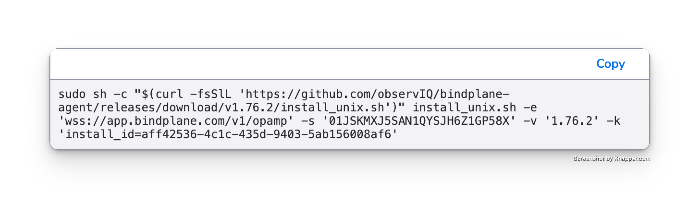

## Docker Compose

The Dynatrace Bindplane Distribution of OpenTelemetry Collector can be installed with Docker and Docker Compose.

## Prerequisites

Before installing the Dynatrace Bindplane Distribution of OpenTelemetry Collector using Docker Compose, ensure you have the following installed:

- Docker Engine (version 20.10.0 or later)
- Docker Compose (version 2.0.0 or later)

## Installation Steps

1. Create directories and files to store both Docker Compose and DBDOT Collector configuration files:

```
> config
> storage
    config.yaml
    logging.yaml
  docker-compose.yaml
```

On startup the collector will create a `manager.yaml` in the config directory based on the OpAMP environment variables.

2. Paste the following content into your `docker-compose.yaml`:

```yaml
services:
  dbdot-collector:
    image: ghcr.io/dynatrace/dbdot:0.0.4
    command: ["--config=/etc/otel/storage/config.yaml"]
    volumes:
      - ./config:/etc/otel/config
      - ./storage:/etc/otel/storage
    ports:
      - "4317:4317"   # OTLP gRPC
      - "4318:4318"   # OTLP HTTP
      - "13133:13133" # Health check extension
      - "55679:55679" # ZPages debugging
    environment:
      OPAMP_ENDPOINT: <your-endpoint> # use "wss://app.bindplane.com/v1/opamp" for Bindplane Cloud
      OPAMP_SECRET_KEY: <your-secret-key>
      OPAMP_AGENT_NAME: dbdot-collector
      CONFIG_YAML_PATH: /etc/otel/storage/config.yaml
      MANAGER_YAML_PATH: /etc/otel/config/manager.yaml
      LOGGING_YAML_PATH: /etc/otel/storage/logging.yaml

```

> Images are published to `ghcr.io/dynatrace/dbdot` with the version number as the tag (no `v` prefix, no `latest` tag). Replace `0.0.4` with the [release](https://github.com/dynatrace/dynatrace-bindplane-otel-collector/releases) you want to run.

> The container runs as a non-root user (UID 10005), so the mounted `config` and `storage` directories must be writable by that UID.

Get your keys from the **Agents > Install Agents** page in Bindplane.



3. Paste this into your `config.yaml` file in the `storage` directory:

```yaml
receivers:
  nop:
exporters:
  nop:
service:
  pipelines:
    metrics:
      receivers: [nop]
      exporters: [nop]
  telemetry:
    metrics:
      level: none
```

> This configuration will be modified by Bindplane and should not be edited after the initial deployment.

4. Paste this into your `logging.yaml` file in the storage directory:

```yaml
output: stdout
level: info
```

5. Start the DBDOT Collector using Docker Compose:

```bash
docker compose up -d
```

## Verifying the Installation

To verify that the collector is running correctly:

1. Check the container status:
```bash
docker compose ps
```

2. View the logs:
```bash
docker compose logs -f
```

## Configuring the DBDOT Collector

Roll out a configuration update from Bindplane.

## Uninstalling

Stop Docker Compose and remove the DBDOT Collector container.

```
docker compose down -v
```
