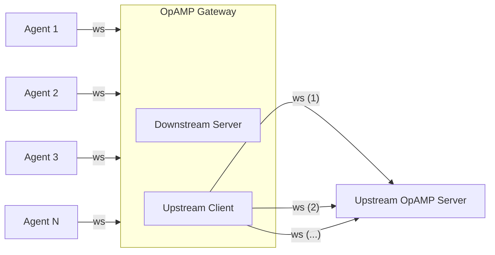

# OpAMP Gateway Extension

| Status  |           |
|---------|-----------|
| Stability | [alpha]  |
| Type    | extension |

The OpAMP Gateway is an OpenTelemetry Collector extension that relays
[OpAMP](https://opentelemetry.io/docs/specs/opamp/) messages between
downstream agents and an upstream OpAMP server. It multiplexes many agent
WebSocket connections over a configurable number of persistent upstream
connections, reducing the connection load on the OpAMP server.

The Collector running this extension is typically also configured as an
[OpenTelemetry Gateway](https://opentelemetry.io/docs/collector/deployment/gateway/)
to receive telemetry from agents and forward it to a backend. Multiple
gateways can be chained together, and gateways can be deployed behind a load
balancer for high availability.

## Motivations

1. **Network isolation** -- In deployments where agents cannot reach the OpAMP
   server directly (firewalled or air-gapped networks), the gateway acts as a
   relay that bridges the two networks.

2. **Connection fan-in** -- Rather than requiring a dedicated WebSocket per
   agent, the gateway fans thousands of agent connections into a small number
   of upstream connections, making it practical to scale to very large fleets.

## How It Works



1. The gateway opens `upstream_connections` persistent WebSocket connections to
   the upstream OpAMP server.
2. The gateway listens for incoming agent WebSocket connections on the
   configured `opamp_server.endpoint`.
3. When an agent connects, the gateway authenticates it by sending an
   `OpampGatewayConnect` custom message upstream and waiting for an
   `OpampGatewayConnectResult` response. If rejected, the agent receives the
   appropriate HTTP status code.
4. Once accepted, the agent's WebSocket is upgraded. A downstream connection is
   assigned to the upstream connection with the fewest active agents
   (least-connections load balancing).
5. All `AgentToServer` messages from the agent are forwarded upstream on the
   assigned connection. All `ServerToAgent` messages addressed to the agent are
   forwarded back downstream.

## Configuration

| Field | Type | Default | Description |
|-------|------|---------|-------------|
| `upstream_opamp_address` | string | *(required)* | WebSocket URL of the upstream OpAMP server. Must use `ws://` or `wss://` scheme. |
| `secret_key` | string | `""` | Secret key sent as `Authorization: Secret-Key <value>` header on upstream connections. |
| `upstream_connections` | int | `1` | Number of persistent WebSocket connections to maintain to the upstream server. |
| `opamp_server.endpoint` | string | `"0.0.0.0:0"` | Address the downstream server listens on for agent connections. |
| `opamp_server.tls` | [TLS config](https://pkg.go.dev/go.opentelemetry.io/collector/config/configtls#ServerConfig) | *(none)* | TLS configuration for the downstream server. |

### Example

```yaml
extensions:
  opampgateway:
    upstream_opamp_address: wss://opamp.example.com/v1/opamp
    secret_key: ${env:OPAMP_SECRET_KEY}
    upstream_connections: 3
    opamp_server:
      endpoint: 0.0.0.0:4320
      tls:
        cert_file: /etc/otel/server.crt
        key_file: /etc/otel/server.key

service:
  extensions: [opampgateway]
```

### Minimal (no TLS)

```yaml
extensions:
  opampgateway:
    upstream_opamp_address: ws://opamp-server:4320/v1/opamp
    opamp_server:
      endpoint: 0.0.0.0:4320

service:
  extensions: [opampgateway]
```

## Authentication

The gateway delegates agent authentication to the upstream OpAMP server. When
an agent connects, the gateway sends the agent's HTTP headers and remote
address upstream as an `OpampGatewayConnect` custom message
(capability: `com.bindplane.opamp-gateway`, type: `connect`). The upstream
server responds with an `OpampGatewayConnectResult` (type: `connectResult`)
indicating whether to accept or reject the connection, along with an HTTP
status code and optional response headers.

If the upstream server does not respond within 30 seconds, the agent receives a
`504 Gateway Timeout`.

## Telemetry

The extension emits the following metrics, all tagged with a `direction`
attribute (`upstream` or `downstream`):

| Metric | Type | Unit | Description |
|--------|------|------|-------------|
| `opampgateway.connections` | Sum (int) | `{connections}` | Current number of active connections. |
| `opampgateway.messages` | Sum (int, monotonic) | `{messages}` | Total messages forwarded. |
| `opampgateway.message.bytes` | Sum (int, monotonic) | `B` | Total bytes forwarded. |
| `opampgateway.messages.latency` | Histogram (int) | `ms` | Time spent in the gateway before forwarding a message. |
